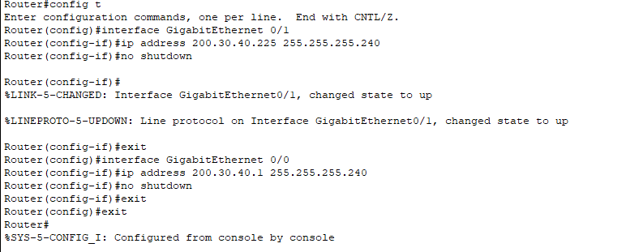
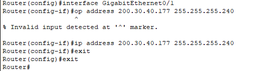
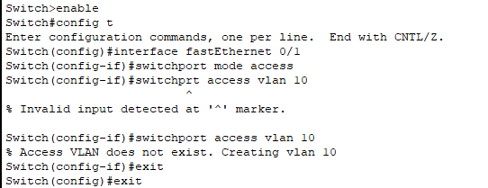
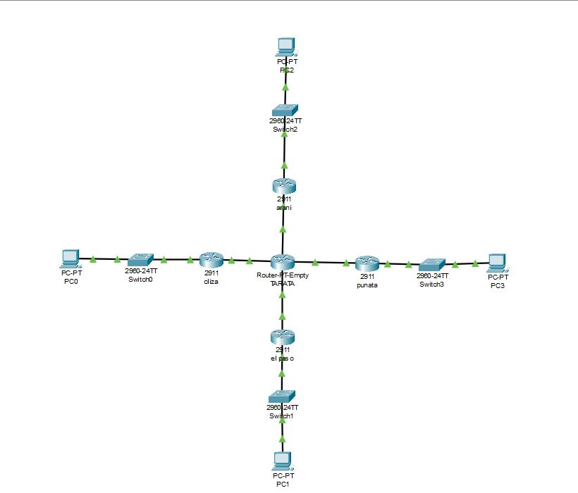

# **Configuración de Red en Cisco Packet Tracer**  

## **1. Introducción**  

En este proyecto, se configuró una red en **Cisco Packet Tracer** utilizando la dirección IP base **200.30.40.0/24**, proporcionada por el ingeniero de redes. Para dividir la red en múltiples segmentos y asegurar la conectividad entre dispositivos, se realizó un **subnetting** para obtener **16 subredes** con una máscara **/28 (255.255.255.240)**.  

Posteriormente, se configuraron los **routers y switches**, y se implementó una **VLAN 10** para segmentar la red y optimizar el tráfico.  

---

## **2. Subnetting y Asignación de Direcciones IP**  

Dado que la dirección base es **200.30.40.0/24**, se realizó la subdivisión en **16 subredes** con **14 hosts utilizables en cada una**.  

### **Lista de Subredes Generadas**  

| Subred           | Rango de Hosts Utilizables    |
|-----------------|--------------------------------|
| 200.30.40.0/28   | 200.30.40.1 - 200.30.40.14    |
| 200.30.40.16/28  | 200.30.40.17 - 200.30.40.30   |
| 200.30.40.32/28  | 200.30.40.33 - 200.30.40.46   |
| 200.30.40.48/28  | 200.30.40.49 - 200.30.40.62   |
| 200.30.40.64/28  | 200.30.40.65 - 200.30.40.78   |
| 200.30.40.80/28  | 200.30.40.81 - 200.30.40.94   |
| 200.30.40.96/28  | 200.30.40.97 - 200.30.40.110  |
| 200.30.40.112/28 | 200.30.40.113 - 200.30.40.126 |
| 200.30.40.128/28 | 200.30.40.129 - 200.30.40.142 |
| 200.30.40.144/28 | 200.30.40.145 - 200.30.40.158 |
| 200.30.40.160/28 | 200.30.40.161 - 200.30.40.174 |
| 200.30.40.176/28 | 200.30.40.177 - 200.30.40.190 |
| 200.30.40.192/28 | 200.30.40.193 - 200.30.40.206 |
| 200.30.40.208/28 | 200.30.40.209 - 200.30.40.222 |
| 200.30.40.224/28 | 200.30.40.225 - 200.30.40.238 |
| 200.30.40.240/28 | 200.30.40.241 - 200.30.40.254 |

---

## **3. Configuración de Routers**  

Una vez definidas las subredes, se configuraron los **routers** asignando direcciones IP a sus interfaces y asegurando la conectividad entre ellos.  

### **Ejemplo de configuración de un router**  

1. **Acceder al modo de configuración:**  
   ```bash
   enable
   config t
   ```
2. **Configurar las interfaces con sus direcciones IP:**  

   **Router 1 (R1):**  
   ```bash
   interface gigabitEthernet 0/0
   ip address 200.30.40.225 255.255.255.240
   no shutdown
   exit

    interface gigabitEthernet 0/0
   ip address 200.30.40.1 255.255.255.240
   no shutdown
   exit

   ```




   **Router 2 (R2):**  
   ```bash
   interface gigabitEthernet 0/1
   ip address 200.30.49.177 255.255.255.240
   no shutdown
   exit

   interface gigabitEthernet 0/0
   ip address 200.30.40.161 255.255.255.240
   no shutdown
   exit
   ```
  

3. **Guardar la configuración:**  
   ```bash
   write memory
   ```

---

y asi con todas los routers 

## **4. Configuración de Switch y Creación de VLAN 10**  

Para segmentar la red y optimizar la administración del tráfico, se configuró un **switch** con la creación de **VLAN 10**.  

### **Configuración del Switch**  

1. **Acceder al modo de configuración:**  
   ```bash
   enable
   config t
   ```
2. **Configurar un puerto en modo acceso y asignarlo a VLAN 10:**  
   ```bash
   interface fastEthernet 0/1
   switchport mode access
   switchport access vlan 10
   exit
   ```
   ⚠ *Se generó un mensaje indicando que la VLAN 10 no existía, por lo que fue creada automáticamente.*  

   

3. **Guardar la configuración:**  
   ```bash
   write memory
   ```

---



## **5. Conclusión**  

Se realizó con éxito la configuración de la red en **Cisco Packet Tracer**, cumpliendo con los siguientes objetivos:  

✅ Se realizó **subnetting** para dividir la red en 16 subredes.  
✅ Se configuraron **routers con direcciones IP** en sus interfaces.  
✅ Se estableció la **conexión con switches** y se creó la **VLAN 10**.  

